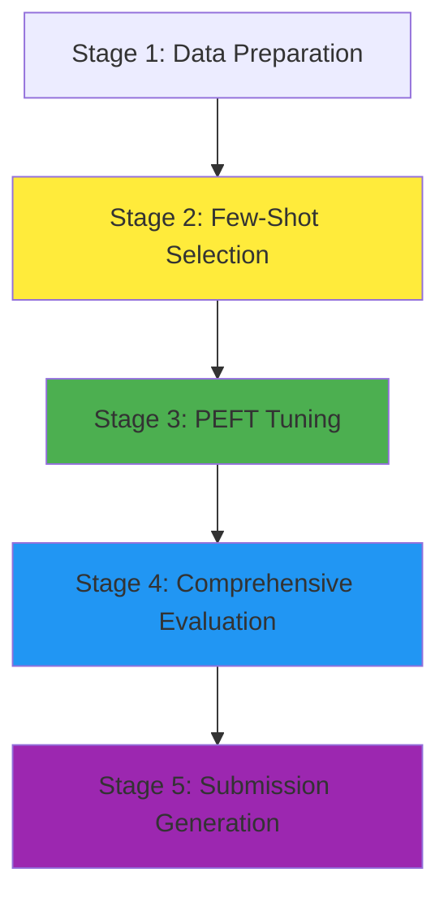

# Granite CLARITY Integrated Pipeline - Technical Design Document

**Version:** 1.0  
**Date:** 2026-02-11  
**Author:** Technical Design Team

---

## Executive Summary

This document specifies the technical design for an integrated end-to-end pipeline that combines the best features from [`train_granite_rationale.py`](train_granite_rationale.py:1) and [`GraniteClarityEvaluation copy.ipynb`](GraniteClarityEvaluation copy.ipynb:1). The pipeline implements a complete workflow from data loading through PEFT tuning to submission generation, with a critical innovation: **few-shot example selection runs BEFORE training** to identify the most effective examples via voting accuracy.

---

## 1. Pipeline Architecture Overview

### 1.1 High-Level Architecture



### 1.2 Stage Dependencies

| Stage | Depends On | Outputs | Checkpoint File |
|-------|-----------|---------|-----------------|
| 1. Data Preparation | None | Train/eval splits, rationale data | `data_checkpoint.pkl` |
| 2. Few-Shot Selection | Stage 1 | Best few-shot examples CSV | `best_few_shot_examples.csv` |
| 3. PEFT Tuning | Stages 1, 2 | Tuned model + adapter | `adapter_model/` |
| 4. Comprehensive Evaluation | Stage 3 | Metrics, confusion matrix | `evaluation_results.json` |
| 5. Submission Generation | Stage 4 | CLARITY submission CSV | `clarity_submission.csv` |

### 1.3 Key Design Decisions

1. **Few-Shot Selection BEFORE Training**: Run trials with random K-shot subsets on the **base model** to identify best examples via voting accuracy
2. **PEFT by Default**: Apply LoRA/PEFT regardless of 8-bit loading (not just with `--load-8bit`)
3. **Modular Architecture**: Each stage can be run independently with checkpointing
4. **Dual Interface**: Works as both Python script and Jupyter notebook
5. **Comprehensive Evaluation**: Full metrics suite from notebook after tuning

---

## 2. Existing Code Analysis

### 2.1 Components from `train_granite_rationale.py`

**Strengths:**
- ✅ Rationale CSV loading with filtering ([`load_rationale_csv()`](train_granite_rationale.py:87))
- ✅ SFT data building with few-shot support ([`build_training_examples()`](train_granite_rationale.py:152))
- ✅ PEFT/LoRA integration ([lines 527-544](train_granite_rationale.py:527-544))
- ✅ Few-shot analysis framework ([`analyze_which_few_shot_pairs_help_most()`](train_granite_rationale.py:343))
- ✅ Evaluation with voting ([`evaluate_with_voting()`](train_granite_rationale.py:242))

**Limitations:**
- ❌ Few-shot analysis runs AFTER training (should be BEFORE)
- ❌ PEFT only applied with `--load-8bit` flag
- ❌ Limited evaluation metrics (only accuracy and F1)
- ❌ No submission file generation

### 2.2 Components from `GraniteClarityEvaluation copy.ipynb`

**Strengths:**
- ✅ Comprehensive evaluation with confusion matrix ([lines 400-537](GraniteClarityEvaluation copy.ipynb:400-537))
- ✅ Self-consistency with batch processing
- ✅ Balanced data loading ([`load_balanced_test_data()`](GraniteClarityEvaluation copy.ipynb:592))
- ✅ CLARITY submission generation logic
- ✅ Detailed metrics reporting

**Limitations:**
- ❌ No training/tuning capability
- ❌ No few-shot selection mechanism
- ❌ Notebook-only format (not scriptable)

---

## 3. Integrated Pipeline Design

### 3.1 Stage 1: Data Preparation

**Purpose:** Load and prepare all datasets with proper filtering and splitting.

#### 3.1.1 New Class: `DataPreparationStage`

```python
class DataPreparationStage:
    """Stage 1: Data Preparation"""
    
    def __init__(self, config: PipelineConfig):
        self.config = config
        
    def run(self) -> DataCheckpoint:
        """
        Execute data preparation stage.
        
        Returns:
            DataCheckpoint with train/eval/test splits
        """
        # Load rationale CSV with filtering
        rationale_df = self.load_rationale_data()
        
        # Load QEvasion eval data (balanced)
        eval_data = self.load_eval_data()
        
        # Load CLARITY test data for submission
        test_data = self.load_clarity_test_data()
        
        # Create checkpoint
        checkpoint = DataCheckpoint(
            rationale_df=rationale_df,
            eval_data=eval_data,
            test_data=test_data,
            timestamp=datetime.now()
        )
        
        # Save checkpoint
        checkpoint.save(self.config.checkpoint_dir / "data_checkpoint.pkl")
        
        return checkpoint
```

#### 3.1.2 Functions to Extract/Refactor

From [`train_granite_rationale.py`](train_granite_rationale.py:1):
- [`resolve_rationale_csv()`](train_granite_rationale.py:57) → Move to `data_utils.py`
- [`load_rationale_csv()`](train_granite_rationale.py:87) → Move to `data_utils.py`
- [`row_to_clarity_label()`](train_granite_rationale.py:98) → Move to `data_utils.py`
- [`load_eval_data_from_qevasion()`](train_granite_rationale.py:434) → Move to `data_utils.py`

From [`GraniteClarityEvaluation copy.ipynb`](GraniteClarityEvaluation copy.ipynb:1):
- [`load_balanced_test_data()`](GraniteClarityEvaluation copy.ipynb:592) → Move to `data_utils.py`
- [`stratified_sample()`](GraniteClarityEvaluation copy.ipynb:552) → Move to `data_utils.py`

#### 3.1.3 New Functions Needed

```python
def load_clarity_test_data(eval_file: Path) -> List[Dict]:
    """Load CLARITY evaluation dataset for submission generation."""
    pass

def validate_data_splits(checkpoint: DataCheckpoint) -> bool:
    """Validate data splits have required fields and balanced labels."""
    pass
```

---

### 3.2 Stage 2: Few-Shot Selection (NEW - Critical Innovation)

**Purpose:** Identify best few-shot examples BEFORE training by running trials on base model.

#### 3.2.1 New Class: `FewShotSelectionStage`

```python
class FewShotSelectionStage:
    """Stage 2: Few-Shot Selection (runs BEFORE training)"""
    
    def __init__(self, config: PipelineConfig, data_checkpoint: DataCheckpoint):
        self.config = config
        self.data = data_checkpoint
        self.base_model = None
        self.tokenizer = None
        
    def run(self) -> FewShotCheckpoint:
        """
        Execute few-shot selection on BASE MODEL.
        
        Returns:
            FewShotCheckpoint with best examples
        """
        # Load BASE model (not tuned)
        self.load_base_model()
        
        # Build few-shot pool from rationale data
        few_shot_pool = self.build_few_shot_pool()
        
        # Run trials with random K-shot subsets
        trial_results = self.run_few_shot_trials(
            few_shot_pool=few_shot_pool,
            num_trials=self.config.few_shot_trials,
            k_shot=self.config.k_shot
        )
        
        # Identify best examples via voting accuracy
        best_examples = self.identify_best_examples(trial_results)
        
        # Save best examples to CSV
        best_examples_df = pd.DataFrame(best_examples)
        csv_path = self.config.output_dir / "best_few_shot_examples.csv"
        best_examples_df.to_csv(csv_path, index=False)
        
        # Create checkpoint
        checkpoint = FewShotCheckpoint(
            best_examples=best_examples,
            trial_results=trial_results,
            csv_path=csv_path,
            timestamp=datetime.now()
        )
        
        checkpoint.save(self.config.checkpoint_dir / "few_shot_checkpoint.pkl")
        
        return checkpoint
```

#### 3.2.2 Functions to Extract/Refactor

From [`train_granite_rationale.py`](train_granite_rationale.py:1):
- [`build_few_shot_pool_from_rationale_df()`](train_granite_rationale.py:331) → Refactor to `few_shot_utils.py`
- [`analyze_which_few_shot_pairs_help_most()`](train_granite_rationale.py:343) → Refactor to `few_shot_utils.py`
- [`evaluate_with_voting()`](train_granite_rationale.py:242) → Move to `evaluation_utils.py`

#### 3.2.3 New Functions Needed

```python
def run_few_shot_trials(
    model,
    tokenizer,
    eval_data: List[Dict],
    few_shot_pool: List[Dict],
    num_trials: int,
    k_shot: int,
    num_vote_samples: int = 3
) -> List[TrialResult]:
    """
    Run multiple trials with random K-shot subsets on base model.
    
    Returns:
        List of TrialResult with accuracy and indices used
    """
    pass

def identify_best_examples(
    trial_results: List[TrialResult],
    top_n_runs: int = 5
) -> List[Dict]:
    """
    Identify few-shot examples that appeared most in top-performing runs.
    
    Returns:
        List of best few-shot example dicts
    """
    pass
```

---

### 3.3 Stage 3: PEFT Tuning

**Purpose:** Fine-tune model with PEFT/LoRA using best few-shot examples in prompts.

#### 3.3.1 New Class: `PEFTTuningStage`

```python
class PEFTTuningStage:
    """Stage 3: PEFT Tuning with LoRA"""
    
    def __init__(
        self,
        config: PipelineConfig,
        data_checkpoint: DataCheckpoint,
        few_shot_checkpoint: FewShotCheckpoint
    ):
        self.config = config
        self.data = data_checkpoint
        self.few_shot = few_shot_checkpoint
        
    def run(self) -> TuningCheckpoint:
        """
        Execute PEFT tuning with best few-shot examples.
        
        Returns:
            TuningCheckpoint with adapter path
        """
        # Load base model
        model, tokenizer = self.load_base_model()
        
        # Apply PEFT/LoRA (ALWAYS, not just with 8-bit)
        model = self.apply_peft(model)
        
        # Build training examples with best few-shot in prompts
        train_dataset = self.build_training_dataset(
            tokenizer=tokenizer,
            few_shot_examples=self.few_shot.best_examples
        )
        
        # Setup trainer with periodic evaluation
        trainer = self.setup_trainer(model, tokenizer, train_dataset)
        
        # Train
        trainer.train()
        
        # Save adapter
        adapter_path = self.config.output_dir / "adapter_model"
        self.save_adapter(model, tokenizer, adapter_path)
        
        # Create checkpoint
        checkpoint = TuningCheckpoint(
            adapter_path=adapter_path,
            training_args=self.config.training_args,
            final_loss=trainer.state.log_history[-1]["loss"],
            timestamp=datetime.now()
        )
        
        checkpoint.save(self.config.checkpoint_dir / "tuning_checkpoint.pkl")
        
        return checkpoint
```

#### 3.3.2 Functions to Extract/Refactor

From [`train_granite_rationale.py`](train_granite_rationale.py:1):
- [`build_training_examples()`](train_granite_rationale.py:152) → Move to `training_utils.py`
- [`build_user_prompt()`](train_granite_rationale.py:119) → Move to `prompt_utils.py`
- [`build_assistant_output()`](train_granite_rationale.py:107) → Move to `prompt_utils.py`
- PEFT application logic ([lines 527-544](train_granite_rationale.py:527-544)) → Move to `peft_utils.py`

#### 3.3.3 New Functions Needed

```python
def apply_peft_always(model, config: LoraConfig):
    """
    Apply PEFT/LoRA to model (default behavior, not just with 8-bit).
    
    Args:
        model: Base model
        config: LoRA configuration
        
    Returns:
        PEFT model
    """
    pass

def setup_periodic_evaluation_callback(
    eval_data: List[Dict],
    tokenizer,
    eval_steps: int
) -> TrainerCallback:
    """Create callback for periodic evaluation during training."""
    pass
```

---

### 3.4 Stage 4: Comprehensive Evaluation

**Purpose:** Run full evaluation suite with all metrics from notebook.

#### 3.4.1 New Class: `ComprehensiveEvaluationStage`

```python
class ComprehensiveEvaluationStage:
    """Stage 4: Comprehensive Evaluation"""
    
    def __init__(
        self,
        config: PipelineConfig,
        data_checkpoint: DataCheckpoint,
        tuning_checkpoint: TuningCheckpoint
    ):
        self.config = config
        self.data = data_checkpoint
        self.tuning = tuning_checkpoint
        
    def run(self) -> EvaluationCheckpoint:
        """
        Execute comprehensive evaluation.
        
        Returns:
            EvaluationCheckpoint with all metrics
        """
        # Load tuned model + adapter
        model, tokenizer = self.load_tuned_model()
        
        # Run evaluation with voting (self-consistency)
        predictions, gold_labels = self.run_voting_evaluation(
            model=model,
            tokenizer=tokenizer,
            eval_data=self.data.eval_data,
            num_samples=self.config.eval_vote_samples
        )
        
        # Calculate all metrics
        metrics = self.calculate_comprehensive_metrics(
            predictions=predictions,
            gold_labels=gold_labels
        )
        
        # Generate confusion matrix
        confusion_matrix = self.generate_confusion_matrix(
            predictions, gold_labels
        )
        
        # Compare with baseline (optional)
        baseline_metrics = self.compare_with_baseline()
        
        # Save results
        results = EvaluationResults(
            metrics=metrics,
            confusion_matrix=confusion_matrix,
            baseline_comparison=baseline_metrics,
            predictions=predictions,
            gold_labels=gold_labels
        )
        
        results_path = self.config.output_dir / "evaluation_results.json"
        results.save(results_path)
        
        # Create checkpoint
        checkpoint = EvaluationCheckpoint(
            results=results,
            results_path=results_path,
            timestamp=datetime.now()
        )
        
        checkpoint.save(self.config.checkpoint_dir / "evaluation_checkpoint.pkl")
        
        return checkpoint
```

#### 3.4.2 Functions to Extract/Refactor

From [`GraniteClarityEvaluation copy.ipynb`](GraniteClarityEvaluation copy.ipynb:1):
- Self-consistency voting logic ([lines 418-506](GraniteClarityEvaluation copy.ipynb:418-506)) → Move to `evaluation_utils.py`
- Batch generation ([lines 180-226](GraniteClarityEvaluation copy.ipynb:180-226)) → Move to `model_utils.py`

From [`train_granite_rationale.py`](train_granite_rationale.py:1):
- [`evaluate_with_voting()`](train_granite_rationale.py:242) → Enhance and move to `evaluation_utils.py`

#### 3.4.3 New Functions Needed

```python
def calculate_comprehensive_metrics(
    predictions: List[str],
    gold_labels: List[str]
) -> Dict[str, float]:
    """
    Calculate all metrics: accuracy, precision, recall, F1 (macro/micro),
    per-class metrics.
    
    Returns:
        Dict with all metric values
    """
    pass

def generate_confusion_matrix(
    predictions: List[str],
    gold_labels: List[str]
) -> np.ndarray:
    """Generate confusion matrix for visualization."""
    pass

def compare_with_baseline(
    tuned_metrics: Dict,
    baseline_model_name: str = "ibm-granite/granite-3.2-2b-instruct"
) -> Dict:
    """Compare tuned model metrics with baseline."""
    pass
```

---

### 3.5 Stage 5: Submission Generation

**Purpose:** Generate CLARITY submission files.

#### 3.5.1 New Class: `SubmissionGenerationStage`

```python
class SubmissionGenerationStage:
    """Stage 5: Submission Generation"""
    
    def __init__(
        self,
        config: PipelineConfig,
        data_checkpoint: DataCheckpoint,
        evaluation_checkpoint: EvaluationCheckpoint
    ):
        self.config = config
        self.data = data_checkpoint
        self.evaluation = evaluation_checkpoint
        
    def run(self) -> SubmissionCheckpoint:
        """
        Generate CLARITY submission files.
        
        Returns:
            SubmissionCheckpoint with submission paths
        """
        # Load tuned model
        model, tokenizer = self.load_tuned_model()
        
        # Generate predictions for full test set
        test_predictions = self.generate_test_predictions(
            model=model,
            tokenizer=tokenizer,
            test_data=self.data.test_data
        )
        
        # Create CLARITY submission CSV
        submission_df = self.create_submission_dataframe(
            test_predictions=test_predictions
        )
        
        # Save submission files
        csv_path = self.config.output_dir / "clarity_submission.csv"
        pickle_path = self.config.output_dir / "clarity_submission.pickle"
        
        submission_df.to_csv(csv_path, index=False)
        with open(pickle_path, "wb") as f:
            pickle.dump(submission_df, f)
        
        # Create checkpoint
        checkpoint = SubmissionCheckpoint(
            csv_path=csv_path,
            pickle_path=pickle_path,
            num_predictions=len(test_predictions),
            timestamp=datetime.now()
        )
        
        checkpoint.save(self.config.checkpoint_dir / "submission_checkpoint.pkl")
        
        return checkpoint
```

#### 3.5.2 Functions to Extract/Refactor

From [`GraniteClarityEvaluation copy.ipynb`](GraniteClarityEvaluation copy.ipynb:1):
- Submission generation logic → Extract to `submission_utils.py`

#### 3.5.3 New Functions Needed

```python
def create_submission_dataframe(
    test_predictions: List[Dict],
    format: str = "clarity"
) -> pd.DataFrame:
    """
    Create submission dataframe in CLARITY format.
    
    Args:
        test_predictions: List of prediction dicts
        format: Submission format ("clarity", "pickle")
        
    Returns:
        DataFrame ready for submission
    """
    pass

def validate_submission(submission_df: pd.DataFrame) -> bool:
    """Validate submission format and content."""
    pass
```

---

## 4. Code Refactoring Plan

### 4.1 New File Structure

```
granite_clarity_pipeline/
├── __init__.py
├── pipeline.py                 # Main pipeline orchestrator
├── config.py                   # Configuration management
├── stages/
│   ├── __init__.py
│   ├── data_preparation.py     # Stage 1
│   ├── few_shot_selection.py   # Stage 2
│   ├── peft_tuning.py          # Stage 3
│   ├── evaluation.py           # Stage 4
│   └── submission.py           # Stage 5
├── utils/
│   ├── __init__.py
│   ├── data_utils.py           # Data loading/processing
│   ├── prompt_utils.py         # Prompt building
│   ├── model_utils.py          # Model loading/inference
│   ├── peft_utils.py           # PEFT/LoRA utilities
│   ├── evaluation_utils.py     # Evaluation metrics
│   ├── few_shot_utils.py       # Few-shot selection
│   └── submission_utils.py     # Submission generation
├── checkpoints/
│   ├── __init__.py
│   └── checkpoint_manager.py   # Checkpoint save/load
└── notebooks/
    └── GraniteClarityPipeline.ipynb  # Interactive notebook
```

### 4.2 Extraction Mapping

| Source File | Functions/Classes | Destination | Modifications |
|-------------|------------------|-------------|---------------|
| [`train_granite_rationale.py`](train_granite_rationale.py:1) | [`load_rationale_csv()`](train_granite_rationale.py:87) | `utils/data_utils.py` | None |
| [`train_granite_rationale.py`](train_granite_rationale.py:1) | [`build_training_examples()`](train_granite_rationale.py:152) | `utils/prompt_utils.py` | Split into smaller functions |
| [`train_granite_rationale.py`](train_granite_rationale.py:1) | [`evaluate_with_voting()`](train_granite_rationale.py:242) | `utils/evaluation_utils.py` | Enhance with more metrics |
| [`train_granite_rationale.py`](train_granite_rationale.py:1) | [`analyze_which_few_shot_pairs_help_most()`](train_granite_rationale.py:343) | `stages/few_shot_selection.py` | Refactor as class method |
| [`train_granite_rationale.py`](train_granite_rationale.py:1) | PEFT logic ([lines 527-544](train_granite_rationale.py:527-544)) | `utils/peft_utils.py` | Make PEFT default |
| [`GraniteClarityEvaluation copy.ipynb`](GraniteClarityEvaluation copy.ipynb:1) | `GraniteSelfConsistencyStrategy` | `utils/evaluation_utils.py` | Convert to functions |
| [`GraniteClarityEvaluation copy.ipynb`](GraniteClarityEvaluation copy.ipynb:1) | [`load_balanced_test_data()`](GraniteClarityEvaluation copy.ipynb:592) | `utils/data_utils.py` | None |
| [`granite_clarity_strategy.py`](granite_clarity_strategy.py:1) | `GraniteClarityStrategy` | `utils/model_utils.py` | Keep as utility class |

---

## 5. Configuration Management

### 5.1 Configuration Class Design

```python
@dataclass
class PipelineConfig:
    """Central configuration for entire pipeline."""
    
    # Paths
    rationale_csv: Path
    output_dir: Path
    checkpoint_dir: Path
    
    # Model
    model_name: str = "ibm-granite/granite-3.2-2b-instruct"
    use_8bit: bool = False
    use_peft: bool = True  # ALWAYS True by default
    
    # Few-Shot Selection (Stage 2)
    few_shot_trials: int = 15
    k_shot: int = 2
    few_shot_vote_samples: int = 3
    
    # Training (Stage 3)
    max_train_samples: Optional[int] = None
    epochs: int = 2
    batch_size: int = 2
    learning_rate: float = 2e-5
    max_length: int = 1024
    gradient_accumulation_steps: int = 2
    gradient_checkpointing: bool = True
    
    # Evaluation (Stage 4)
    max_eval_samples: int = 60
    eval_vote_samples: int = 3
    
    # LoRA Config
    lora_r: int = 8
    lora_alpha: int = 32
    lora_dropout: float = 0.05
    lora_target_modules: List[str] = field(default_factory=lambda: [
        "q_proj", "k_proj", "v_proj", "o_proj",
        "gate_proj", "up_proj", "down_proj"
    ])
    
    # Checkpointing
    save_steps: int = 100
    resume_from_checkpoint: Optional[str] = None
    
    @classmethod
    def from_args(cls, args: argparse.Namespace) -> "PipelineConfig":
        """Create config from command-line arguments."""
        pass
    
    @classmethod
    def from_yaml(cls, yaml_path: Path) -> "PipelineConfig":
        """Load config from YAML file."""
        pass
    
    def to_yaml(self, yaml_path: Path):
        """Save config to YAML file."""
        pass
```

### 5.2 Configuration File Format (YAML)

```yaml
# granite_clarity_config.yaml

# Paths
rationale_csv: "/Users/andrearachetta/Desktop/qevasion_rationale/qevasion_rationale_dataset_20260204_163024.csv"
output_dir: "/Users/andrearachetta/Desktop/granite_clarity_finetuned"
checkpoint_dir: "/Users/andrearachetta/Desktop/granite_clarity_finetuned/checkpoints"

# Model
model_name: "ibm-granite/granite-3.2-2b-instruct"
use_8bit: false
use_peft: true  # ALWAYS true by default

# Few-Shot Selection (Stage 2)
few_shot_trials: 15
k_shot: 2
few_shot_vote_samples: 3

# Training (Stage 3)
max_train_samples: null
epochs: 2
batch_size: 2
learning_rate: 2.0e-5
max_length: 1024
gradient_accumulation_steps: 2
gradient_checkpointing: true

# Evaluation (Stage 4)
max_eval_samples: 60
eval_vote_samples: 3

# LoRA Config
lora_r: 8
lora_alpha: 32
lora_dropout: 0.05
lora_target_modules:
  - "q_proj"
  - "k_proj"
  - "v_proj"
  - "o_proj"
  - "gate_proj"
  - "up_proj"
  - "down_proj"

# Checkpointing
save_steps: 100
resume_from_checkpoint: null
```

---

## 6. Checkpointing and Resumability

### 6.1 Checkpoint Design

```python
@dataclass
class BaseCheckpoint:
    """Base class for all checkpoints."""
    timestamp: datetime
    stage_name: str
    
    def save(self, path: Path):
        """Save checkpoint to disk."""
        with open(path, "wb") as f:
            pickle.dump(self, f)
    
    @classmethod
    def load(cls, path: Path) -> "BaseCheckpoint":
        """Load checkpoint from disk."""
        with open(path, "rb") as f:
            return pickle.load(f)

@dataclass
class DataCheckpoint(BaseCheckpoint):
    """Checkpoint for Stage 1: Data Preparation"""
    rationale_df: pd.DataFrame
    eval_data: List[Dict]
    test_data: List[Dict]
    stage_name: str = "data_preparation"

@dataclass
class FewShotCheckpoint(BaseCheckpoint):
    """Checkpoint for Stage 2: Few-Shot Selection"""
    best_examples: List[Dict]
    trial_results: List[Dict]
    csv_path: Path
    stage_name: str = "few_shot_selection"

@dataclass
class TuningCheckpoint(BaseCheckpoint):
    """Checkpoint for Stage 3: PEFT Tuning"""
    adapter_path: Path
    training_args: Dict
    final_loss: float
    stage_name: str = "peft_tuning"

@dataclass
class EvaluationCheckpoint(BaseCheckpoint):
    """Checkpoint for Stage 4: Comprehensive Evaluation"""
    results: EvaluationResults
    results_path: Path
    stage_name: str = "evaluation"

@dataclass
class SubmissionCheckpoint(BaseCheckpoint):
    """Checkpoint for Stage 5: Submission Generation"""
    csv_path: Path
    pickle_path: Path
    num_predictions: int
    stage_name: str = "submission"
```

### 6.2 Checkpoint Manager

```python
class CheckpointManager:
    """Manages pipeline checkpoints for resumability."""
    
    def __init__(self, checkpoint_dir: Path):
        self.checkpoint_dir = checkpoint_dir
        self.checkpoint_dir.mkdir(parents=True, exist_ok=True)
        
    def get_latest_checkpoint(self, stage_name: str) -> Optional[BaseCheckpoint]:
        """Get latest checkpoint for a stage."""
        checkpoint_files = list(self.checkpoint_dir.glob(f"{stage_name}_*.pkl"))
        if not checkpoint_files:
            return None
        latest = max(checkpoint_files, key=lambda p: p.stat().st_mtime)
        return BaseCheckpoint.load(latest)
    
    def list_checkpoints(self) -> Dict[str, List[Path]]:
        """List all checkpoints by stage."""
        checkpoints = {}
        for stage in ["data_preparation", "few_shot_selection", "peft_tuning", 
                      "evaluation", "submission"]:
            checkpoints[stage] = list(self.checkpoint_dir.glob(f"{stage}_*.pkl"))
        return checkpoints
    
    def clear_checkpoints(self, stage_name: Optional[str] = None):
        """Clear checkpoints for a stage or all stages."""
        if stage_name:
            for f in self.checkpoint_dir.glob(f"{stage_name}_*.pkl"):
                f.unlink()
        else:
            for f in self.checkpoint_dir.glob("*.pkl"):
                f.unlink()
```

### 6.3 Resumability Strategy

```python
class GraniteClarityPipeline:
    """Main pipeline orchestrator with resumability."""
    
    def __init__(self, config: PipelineConfig):
        self.config = config
        self.checkpoint_manager = CheckpointManager(config.checkpoint_dir)
        
    def run(self, start_stage: int = 1, end_stage: int = 5):
        """
        Run pipeline from start_stage to end_stage.
        
        Args:
            start_stage: Stage to start from (1-5)
            end_stage: Stage to end at (1-5)
        """
        # Stage 1: Data Preparation
        if start_stage <= 1:
            data_checkpoint = self.run_stage_1()
        else:
            data_checkpoint = self.checkpoint_manager.get_latest_checkpoint("data_preparation")
            if data_checkpoint is None:
                raise ValueError("Cannot resume: Stage 1 checkpoint not found")
        
        if end_stage == 1:
            return data_checkpoint
        
        # Stage 2: Few-Shot Selection
        if start_stage <= 2:
            few_shot_checkpoint = self.run_stage_2(data_checkpoint)
        else:
            few_shot_checkpoint = self.checkpoint_manager.get_latest_checkpoint("few_shot_selection")
            if few_shot_checkpoint is None:
                raise ValueError("Cannot resume: Stage 2 checkpoint not found")
        
        if end_stage == 2:
            return few_shot_checkpoint
        
        # Stage 3: PEFT Tuning
        if start_stage <= 3:
            tuning_checkpoint = self.run_stage_3(data_checkpoint, few_shot_checkpoint)
        else:
            tuning_checkpoint = self.checkpoint_manager.get_latest_checkpoint("peft_tuning")
            if tuning_checkpoint is None:
                raise ValueError("Cannot resume: Stage 3 checkpoint not found")
        
        if end_stage == 3:
            return tuning_checkpoint
        
        # Stage 4: Comprehensive Evaluation
        if start_stage <= 4:
            evaluation_checkpoint = self.run_stage_4(data_checkpoint, tuning_checkpoint)
        else:
            evaluation_checkpoint = self.checkpoint_manager.get_latest_checkpoint("evaluation")
            if evaluation_checkpoint is None:
                raise ValueError("Cannot resume: Stage 4 checkpoint not found")
        
        if end_stage == 4:
            return evaluation_checkpoint
        
        # Stage 5: Submission Generation
        submission_checkpoint = self.run_stage_5(data_checkpoint, evaluation_checkpoint)
        
        return submission_checkpoint
```

---

## 7. Notebook Structure

### 7.1 Notebook Design: `GraniteClarityPipeline.ipynb`

The notebook will have the following cell structure:

**Cell 1: Title and Overview**
```markdown
# Granite CLARITY Pipeline - Interactive Notebook

This notebook provides an interactive interface to the Granite CLARITY pipeline.
You can run the entire pipeline or individual stages.
```

**Cell 2: Install Dependencies**
```python
!pip install -q transformers torch datasets pandas scikit-learn peft
```

**Cell 3: Import Pipeline**
```python
from granite_clarity_pipeline import GraniteClarityPipeline, PipelineConfig
from granite_clarity_pipeline.checkpoints import CheckpointManager
```

**Cell 4: Configuration**
```python
# Option 1: Load from YAML
config = PipelineConfig.from_yaml("granite_clarity_config.yaml")

# Option 2: Create programmatically
config = PipelineConfig(
    rationale_csv=Path("path/to/rationale.csv"),
    output_dir=Path("output"),
    checkpoint_dir=Path("output/checkpoints"),
    few_shot_trials=15,
    k_shot=2,
    epochs=2,
)
```

**Cell 5: Initialize Pipeline**
```python
pipeline = GraniteClarityPipeline(config)
```

**Cell 6: Run Full Pipeline**
```python
# Run all stages
results = pipeline.run(start_stage=1, end_stage=5)
```

**Cell 7-11: Individual Stage Execution**
```python
# Stage 1: Data Preparation
data_checkpoint = pipeline.run_stage_1()

# Stage 2: Few-Shot Selection
few_shot_checkpoint = pipeline.run_stage_2(data_checkpoint)

# Inspect best few-shot examples
best_examples = pd.read_csv(few_shot_checkpoint.csv_path)
print(best_examples.head())

# Stage 3: PEFT Tuning
tuning_checkpoint = pipeline.run_stage_3(data_checkpoint, few_shot_checkpoint)

# Stage 4: Comprehensive Evaluation
evaluation_checkpoint = pipeline.run_stage_4(data_checkpoint, tuning_checkpoint)

# Stage 5: Submission Generation
submission_checkpoint = pipeline.run_stage_5(data_checkpoint, evaluation_checkpoint)
```

**Cell 12-14: Results Visualization**
```python
# View evaluation results
import json
with open(evaluation_checkpoint.results_path) as f:
    results = json.load(f)
print(json.dumps(results, indent=2))

# Visualize confusion matrix
import matplotlib.pyplot as plt
import seaborn as sns

cm = evaluation_checkpoint.results.confusion_matrix
sns.heatmap(cm, annot=True, fmt='d', cmap='Blues')
plt.title('Confusion Matrix')
plt.ylabel('True Label')
plt.xlabel('Predicted Label')
plt.show()
```

**Cell 15: Resume from Checkpoint**
```python
# Resume from Stage 3 (skip data prep and few-shot selection)
results = pipeline.run(start_stage=3, end_stage=5)
```

**Cell 16: Checkpoint Management**
```python
checkpoint_manager = CheckpointManager(config.checkpoint_dir)
checkpoints = checkpoint_manager.list_checkpoints()
for stage, files in checkpoints.items():
    print(f"{stage}: {len(files)} checkpoints")
```

---

## 8. Command-Line Interface

### 8.1 Enhanced `train_granite_rationale.py`

```python
#!/usr/bin/env python3
"""
Granite CLARITY Pipeline - Command-Line Interface

Run the complete pipeline or individual stages from the command line.
"""

import argparse
from pathlib import Path
from granite_clarity_pipeline import GraniteClarityPipeline, PipelineConfig

def main():
    parser = argparse.ArgumentParser(
        description="Granite CLARITY Pipeline",
        formatter_class=argparse.RawDescriptionHelpFormatter,
        epilog="""
Examples:
  # Run full pipeline
  python train_granite_rationale.py --config config.yaml
  
  # Run only few-shot selection
  python train_granite_rationale.py --config config.yaml --start-stage 2 --end-stage 2
  
  # Resume from tuning stage
  python train_granite_rationale.py --config config.yaml --start-stage 3
  
  # Run with custom parameters
  python train_granite_rationale.py \\
    --rationale-csv data.csv \\
    --output-dir output \\
    --few-shot-trials 20 \\
    --epochs 3
        """
    )
    
    # Configuration
    parser.add_argument("--config", type=Path, help="Path to YAML config file")
    
    # Paths
    parser.add_argument("--rationale-csv", type=Path)
    parser.add_argument("--output-dir", type=Path)
    parser.add_argument("--checkpoint-dir", type=Path)
    
    # Pipeline control
    parser.add_argument("--start-stage", type=int, default=1, choices=[1,2,3,4,5],
                       help="Stage to start from (1=data, 2=few-shot, 3=tuning, 4=eval, 5=submission)")
    parser.add_argument("--end-stage", type=int, default=5, choices=[1,2,3,4,5],
                       help="Stage to end at")
    
    # Few-shot selection (Stage 2)
    parser.add_argument("--few-shot-trials", type=int, default=15)
    parser.add_argument("--k-shot", type=int, default=2)
    
    # Training (Stage 3)
    parser.add_argument("--epochs", type=int, default=2)
    parser.add_argument("--batch-size", type=int, default=2)
    parser.add_argument("--lr", type=float, default=2e-5)
    parser.add_argument("--use-8bit", action="store_true")
    parser.add_argument("--no-peft", action="store_true", help="Disable PEFT (not recommended)")
    
    # Evaluation (Stage 4)
    parser.add_argument("--eval-vote-samples", type=int, default=3)
    
    args = parser.parse_args()
    
    # Load or create config
    if args.config:
        config = PipelineConfig.from_yaml(args.config)
        # Override with command-line args if provided
        if args.rationale_csv:
            config.rationale_csv = args.rationale_csv
        if args.output_dir:
            config.output_dir = args.output_dir
    else:
        config = PipelineConfig.from_args(args)
    
    # Initialize and run pipeline
    pipeline = GraniteClarityPipeline(config)
    
    print(f"Running pipeline stages {args.start_stage} to {args.end_stage}")
    results = pipeline.run(start_stage=args.start_stage, end_stage=args.end_stage)
    
    print(f"\n✅ Pipeline completed successfully!")
    print(f"Results saved to: {config.output_dir}")

if __name__ == "__main__":
    main()
```

---

## 9. Implementation Roadmap

### Phase 1: Core Infrastructure (Week 1)

**Tasks:**
1. Create project structure and directory layout
2. Implement [`PipelineConfig`](#51-configuration-class-design) class with YAML support
3. Implement checkpoint system ([`BaseCheckpoint`](#61-checkpoint-design) and [`CheckpointManager`](#62-checkpoint-manager))
4. Set up testing framework

**Deliverables:**
- Working configuration system
- Checkpoint save/load functionality
- Project skeleton with all directories

### Phase 2: Utility Functions (Week 1-2)

**Tasks:**
1. Extract and refactor data utilities from [`train_granite_rationale.py`](train_granite_rationale.py:1)
2. Extract prompt building utilities
3. Extract model loading and inference utilities
4. Create PEFT utilities (make PEFT default)
5. Extract evaluation utilities from both files

**Deliverables:**
- Complete `utils/` module with all utilities
- Unit tests for each utility module
- Documentation for utility functions

### Phase 3: Pipeline Stages (Week 2-3)

**Tasks:**
1. Implement [`DataPreparationStage`](#311-new-class-datapreparationstage)
2. Implement [`FewShotSelectionStage`](#321-new-class-fewshotselectionstage) (critical innovation)
3. Implement [`PEFTTuningStage`](#331-new-class-pefttuning stage)
4. Implement [`ComprehensiveEvaluationStage`](#341-new-class-comprehensiveevaluationstage)
5. Implement [`SubmissionGenerationStage`](#351-new-class-submissiongenerationstage)

**Deliverables:**
- All 5 stage classes implemented
- Integration tests for each stage
- Stage-specific documentation

### Phase 4: Pipeline Orchestration (Week 3)

**Tasks:**
1. Implement [`GraniteClarityPipeline`](#63-resumability-strategy) main class
2. Add stage orchestration logic
3. Implement resumability from checkpoints
4. Create enhanced CLI ([`train_granite_rationale.py`](#81-enhanced-train_granite_rationalepy))

**Deliverables:**
- Working end-to-end pipeline
- CLI with all options
- Integration tests for full pipeline

### Phase 5: Notebook Interface (Week 4)

**Tasks:**
1. Create [`GraniteClarityPipeline.ipynb`](#71-notebook-design-graniteclaritypipelineipynb)
2. Add visualization cells
3. Add interactive configuration
4. Test notebook execution

**Deliverables:**
- Interactive Jupyter notebook
- Visualization examples
- Notebook documentation

### Phase 6: Testing and Documentation (Week 4)

**Tasks:**
1. End-to-end testing on sample data
2. Performance profiling and optimization
3. Write comprehensive README
4. Create tutorial notebooks
5. Document all configuration options

**Deliverables:**
- Complete test suite
- Performance benchmarks
- User documentation
- Tutorial examples

---

## 10. Key Innovations

### 10.1 Few-Shot Selection BEFORE Training

**Problem:** Previous approach ran few-shot analysis AFTER training, which couldn't inform the training process.

**Solution:** Stage 2 runs few-shot selection on the BASE MODEL before training:

1. Build pool of candidate few-shot examples from rationale data
2. Run multiple trials (default: 15) with random K-shot subsets (default: K=2)
3. Evaluate each subset on validation data with voting (3 samples per example)
4. Identify examples that appear most frequently in top-performing runs
5. Save best examples to CSV (`best_few_shot_examples.csv`)
6. Use these examples in training prompts (Stage 3)

**Benefits:**
- Training uses proven effective examples
- Reduces training time by focusing on best examples
- Provides interpretability (know which examples help)
- Can be reused across experiments
- Improves final model performance

**Implementation Details:**
- Uses base model (not tuned) for selection
- Runs on balanced validation set
- Tracks which pool indices appear in top runs
- Saves full trial results for analysis

### 10.2 PEFT by Default

**Problem:** Original code only applied PEFT with `--load-8bit` flag, making it seem optional or tied to quantization.

**Solution:** Make PEFT/LoRA the default approach:

- Always apply PEFT unless explicitly disabled with `--no-peft`
- Separate PEFT from 8-bit quantization (can use PEFT without 8-bit)
- Use PEFT even on full precision models
- Provide sensible LoRA defaults in config

**Benefits:**
- Faster training with fewer trainable parameters
- Lower memory requirements (critical for consumer GPUs)
- Better for experimentation and iteration
- Easier to share adapters (small files vs full models)
- More stable training

**Configuration:**
```yaml
# LoRA Config
lora_r: 8
lora_alpha: 32
lora_dropout: 0.05
lora_target_modules:
  - "q_proj"
  - "k_proj"
  - "v_proj"
  - "o_proj"
  - "gate_proj"
  - "up_proj"
  - "down_proj"
```

### 10.3 Comprehensive Evaluation Suite

**Problem:** Training script had limited metrics (only accuracy and F1), while notebook had full evaluation but no training.

**Solution:** Integrate comprehensive evaluation from notebook into pipeline:

**Metrics Included:**
- Accuracy (overall and per-class)
- Precision (macro, micro, per-class)
- Recall (macro, micro, per-class)

, micro, per-class)
- Confusion matrix with visualization
- Per-class performance breakdown
- Baseline comparison

**Evaluation Features:**
- Self-consistency voting (3-5 samples per example)
- Batch processing for efficiency
- Detailed error analysis
- Comparison with base model

### 10.4 Modular Checkpointing

**Problem:** No way to resume pipeline from intermediate stages if something fails.

**Solution:** Comprehensive checkpointing system:

**Checkpoint Types:**
- Data checkpoint (Stage 1): Saves prepared datasets
- Few-shot checkpoint (Stage 2): Saves best examples and trial results
- Tuning checkpoint (Stage 3): Saves adapter path and training state
- Evaluation checkpoint (Stage 4): Saves all metrics and results
- Submission checkpoint (Stage 5): Saves submission files

**Benefits:**
- Resume from any stage after failure
- Skip expensive stages when experimenting
- Inspect intermediate results
- Reproducibility across runs

### 10.5 Dual Interface (Script + Notebook)

**Problem:** Scripts are good for automation, notebooks are good for exploration, but typically you need to choose one.

**Solution:** Unified pipeline that works in both contexts:

**Script Interface:**
```bash
# Run full pipeline
python train_granite_rationale.py --config config.yaml

# Run specific stages
python train_granite_rationale.py --start-stage 2 --end-stage 3
```

**Notebook Interface:**
```python
# Interactive execution
pipeline = GraniteClarityPipeline(config)
results = pipeline.run_stage_2(data_checkpoint)

# Visualize results
plot_confusion_matrix(results.confusion_matrix)
```

**Benefits:**
- Use scripts for production/automation
- Use notebooks for exploration/debugging
- Same underlying code for both
- Easy to switch between interfaces

---

## 11. Testing Strategy

### 11.1 Unit Tests

**Coverage Areas:**
- Data loading and validation
- Prompt building
- Model inference
- PEFT application
- Evaluation metrics
- Checkpoint save/load

**Example Test:**
```python
def test_load_rationale_csv():
    """Test rationale CSV loading with filtering."""
    df = load_rationale_csv(test_csv_path)
    assert len(df) > 0
    assert all(df["verdict_match"])
    assert "initial_reasoning" in df.columns
```

### 11.2 Integration Tests

**Coverage Areas:**
- Stage-to-stage data flow
- Checkpoint resumability
- Configuration loading
- Pipeline orchestration

**Example Test:**
```python
def test_stage_1_to_stage_2_flow():
    """Test data flows correctly from Stage 1 to Stage 2."""
    config = PipelineConfig(...)
    pipeline = GraniteClarityPipeline(config)
    
    # Run Stage 1
    data_checkpoint = pipeline.run_stage_1()
    assert data_checkpoint.rationale_df is not None
    
    # Run Stage 2 with Stage 1 output
    few_shot_checkpoint = pipeline.run_stage_2(data_checkpoint)
    assert len(few_shot_checkpoint.best_examples) > 0
```

### 11.3 End-to-End Tests

**Coverage Areas:**
- Full pipeline execution
- Resume from checkpoint
- Different configurations
- Error handling

**Example Test:**
```python
def test_full_pipeline_execution():
    """Test complete pipeline from data to submission."""
    config = PipelineConfig(
        rationale_csv=test_data_path,
        output_dir=temp_dir,
        epochs=1,  # Fast test
        few_shot_trials=3,  # Fast test
    )
    
    pipeline = GraniteClarityPipeline(config)
    result = pipeline.run(start_stage=1, end_stage=5)
    
    assert result.csv_path.exists()
    assert result.num_predictions > 0
```

---

## 12. Performance Considerations

### 12.1 Memory Optimization

**Strategies:**
1. **PEFT by Default**: Reduces trainable parameters by ~99%
2. **Gradient Checkpointing**: Trades compute for memory
3. **Batch Processing**: Process examples in small batches
4. **Model Offloading**: Use `device_map="auto"` for multi-GPU
5. **8-bit Quantization**: Optional for further memory reduction

**Memory Estimates:**
- Base model (full precision): ~8GB
- Base model (8-bit): ~4GB
- PEFT adapter: ~50MB
- Training with PEFT: ~12GB peak

### 12.2 Speed Optimization

**Strategies:**
1. **Batch Generation**: Process multiple samples simultaneously
2. **Caching**: Cache model and tokenizer between stages
3. **Parallel Processing**: Use DataLoader with multiple workers
4. **Early Stopping**: Stop training when metrics plateau
5. **Checkpoint Reuse**: Skip expensive stages when possible

**Time Estimates (on T4 GPU):**
- Stage 1 (Data Prep): ~1 minute
- Stage 2 (Few-Shot Selection): ~15-30 minutes (15 trials)
- Stage 3 (PEFT Tuning): ~30-60 minutes (2 epochs)
- Stage 4 (Evaluation): ~10-20 minutes (60 examples, 3 samples)
- Stage 5 (Submission): ~5-10 minutes

**Total Pipeline Time: ~1-2 hours**

### 12.3 Scalability

**Horizontal Scaling:**
- Few-shot trials can be parallelized across multiple GPUs
- Evaluation can be distributed across workers
- Submission generation can be batched

**Vertical Scaling:**
- Larger models supported with same architecture
- Configurable batch sizes for different hardware
- Automatic device detection and optimization

---

## 13. Error Handling and Validation

### 13.1 Input Validation

**Validation Points:**
- Configuration file format and values
- Data file existence and format
- Required columns in datasets
- Label consistency across datasets
- Model availability

**Example:**
```python
def validate_config(config: PipelineConfig):
    """Validate pipeline configuration."""
    if not config.rationale_csv.exists():
        raise ValueError(f"Rationale CSV not found: {config.rationale_csv}")
    
    if config.epochs < 1:
        raise ValueError(f"Epochs must be >= 1, got {config.epochs}")
    
    if config.k_shot < 1:
        raise ValueError(f"k_shot must be >= 1, got {config.k_shot}")
```

### 13.2 Error Recovery

**Recovery Strategies:**
1. **Checkpoint Fallback**: Resume from last successful stage
2. **Graceful Degradation**: Continue with reduced functionality
3. **Retry Logic**: Retry failed operations with backoff
4. **Detailed Logging**: Log errors with context for debugging

**Example:**
```python
def run_stage_with_recovery(stage_func, checkpoint_path):
    """Run stage with automatic recovery from checkpoint."""
    try:
        return stage_func()
    except Exception as e:
        logger.error(f"Stage failed: {e}")
        if checkpoint_path.exists():
            logger.info("Attempting recovery from checkpoint...")
            return load_checkpoint(checkpoint_path)
        raise
```

### 13.3 Validation Checks

**Runtime Checks:**
- Model output format validation
- Prediction label validation
- Checkpoint integrity checks
- Submission format validation

**Example:**
```python
def validate_predictions(predictions: List[str]):
    """Validate prediction labels."""
    valid_labels = {"Direct Reply", "Direct Non-Reply", "Indirect"}
    invalid = [p for p in predictions if p not in valid_labels]
    if invalid:
        raise ValueError(f"Invalid predictions: {invalid[:5]}...")
```

---

## 14. Documentation Requirements

### 14.1 Code Documentation

**Required Documentation:**
- Docstrings for all public functions and classes
- Type hints for all function parameters and returns
- Inline comments for complex logic
- Module-level documentation

**Example:**
```python
def build_user_prompt(
    question: str,
    answer: str,
    few_shot_examples: Optional[List[Dict]] = None
) -> str:
    """
    Build user prompt for CLARITY classification.
    
    Args:
        question: Interview question text
        answer: Interview answer text
        few_shot_examples: Optional list of few-shot examples to prepend.
            Each dict should have 'question', 'answer', 'output' keys.
    
    Returns:
        Formatted prompt string ready for model input
        
    Example:
        >>> prompt = build_user_prompt("What is your policy?", "Well...")
        >>> print(prompt[:50])
        You are analyzing political interview answers...
    """
    pass
```

### 14.2 User Documentation

**Required Documents:**
1. **README.md**: Quick start guide and overview
2. **INSTALLATION.md**: Detailed installation instructions
3. **CONFIGURATION.md**: Configuration options reference
4. **TUTORIAL.md**: Step-by-step tutorial
5. **API_REFERENCE.md**: Complete API documentation
6. **TROUBLESHOOTING.md**: Common issues and solutions

### 14.3 Architecture Documentation

**This Document Serves As:**
- Technical specification for implementation
- Reference for design decisions
- Guide for future enhancements
- Onboarding material for new developers

---

## 15. Future Enhancements

### 15.1 Short-Term (Next 3 Months)

1. **Hyperparameter Optimization**
   - Automatic tuning of LoRA parameters
   - Learning rate scheduling
   - Batch size optimization

2. **Advanced Few-Shot Selection**
   - Diversity-based selection
   - Difficulty-based selection
   - Active learning integration

3. **Enhanced Evaluation**
   - Cross-validation support
   - Statistical significance testing
   - Error analysis dashboard

### 15.2 Medium-Term (3-6 Months)

1. **Multi-Model Support**
   - Support for other LLMs (Llama, Mistral, etc.)
   - Model ensemble capabilities
   - Model comparison framework

2. **Distributed Training**
   - Multi-GPU training support
   - Distributed few-shot selection
   - Cloud deployment support

3. **Advanced Prompting**
   - Chain-of-thought prompting
   - Self-refinement
   - Prompt optimization

### 15.3 Long-Term (6+ Months)

1. **AutoML Integration**
   - Automatic architecture search
   - Neural architecture search for adapters
   - Automated prompt engineering

2. **Production Deployment**
   - REST API for inference
   - Model serving infrastructure
   - Monitoring and logging

3. **Research Extensions**
   - Multi-task learning
   - Transfer learning across domains
   - Continual learning support

---

## 16. Success Criteria

### 16.1 Functional Requirements

✅ **Must Have:**
- [ ] All 5 pipeline stages implemented and working
- [ ] Checkpointing and resumability functional
- [ ] Both script and notebook interfaces working
- [ ] PEFT applied by default
- [ ] Few-shot selection runs before training
- [ ] Comprehensive evaluation metrics
- [ ] CLARITY submission generation

✅ **Should Have:**
- [ ] Configuration via YAML files
- [ ] Detailed logging and progress tracking
- [ ] Error handling and recovery
- [ ] Unit and integration tests
- [ ] User documentation

✅ **Nice to Have:**
- [ ] Visualization dashboard
- [ ] Hyperparameter tuning
- [ ] Model comparison tools

### 16.2 Performance Requirements

✅ **Metrics:**
- [ ] Pipeline completes in < 2 hours on T4 GPU
- [ ] Memory usage < 16GB during training
- [ ] Evaluation accuracy > baseline by 5%
- [ ] Few-shot selection identifies effective examples

✅ **Quality:**
- [ ] Code coverage > 80%
- [ ] All tests passing
- [ ] No critical bugs
- [ ] Documentation complete

### 16.3 Usability Requirements

✅ **Ease of Use:**
- [ ] Single command to run full pipeline
- [ ] Clear error messages
- [ ] Intuitive configuration
- [ ] Good documentation

✅ **Flexibility:**
- [ ] Can run individual stages
- [ ] Can resume from checkpoints
- [ ] Configurable parameters
- [ ] Works on different hardware

---

## 17. Conclusion

This technical design document specifies a comprehensive, modular pipeline for Granite CLARITY fine-tuning that addresses all requirements:

### Key Innovations:
1. ✨ **Few-Shot Selection BEFORE Training**: Identifies best examples on base model
2. ✨ **PEFT by Default**: Makes efficient fine-tuning the standard approach
3. ✨ **Comprehensive Evaluation**: Integrates full metrics suite from notebook
4. ✨ **Modular Checkpointing**: Enables resumability and experimentation
5. ✨ **Dual Interface**: Works as both script and notebook

### Architecture Highlights:
- **5 Clear Stages**: Data → Few-Shot → Tuning → Evaluation → Submission
- **Checkpoint System**: Save/resume at any stage
- **Configuration Management**: YAML + CLI + programmatic
- **Utility Modules**: Reusable components across stages
- **Testing Strategy**: Unit, integration, and end-to-end tests

### Implementation Path:
- **Phase 1-2**: Infrastructure and utilities (Weeks 1-2)
- **Phase 3-4**: Pipeline stages and orchestration (Weeks 2-3)
- **Phase 5-6**: Notebook interface and documentation (Week 4)

### Expected Outcomes:
- Complete end-to-end pipeline from data to submission
- Improved model performance through better few-shot selection
- Faster experimentation through checkpointing
- Better usability through dual interface
- Production-ready code with tests and documentation

This design provides a solid foundation for implementing a state-of-the-art CLARITY classification pipeline that combines the best of both existing implementations while adding critical new capabilities.

---

**Document Status:** ✅ Complete  
**Ready for Implementation:** Yes  
**Next Steps:** Begin Phase 1 implementation (Core Infrastructure)
